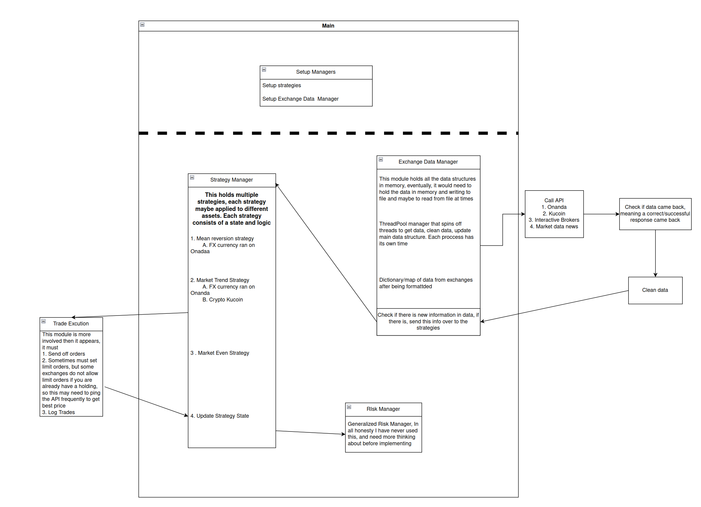

### Work in progress
still in more of design phase, but just beginning to implement.

### Note to self

Part 1.
The first iteration I want to make of this.
1. looks for 3 > sd moves on each specifc time frame (5,30,1hr, 4hr, day)
2. Does the opposite of the move
3. Searches this for forex, crypto, stocks.
4. This means I have to have my mean, map look up table calculatd at start or create the table and read it in to memory from file instead of recreating it(this really isn'
t important)
5. The looking for high sd moves, will take tinker with exchanges to figure out when they best display this.
6. Also I need to find/optimize the exit strategies, stop losses and take profit
7. Add a Markov chain like calculation to decide when to exit
8. figuring out how often to ping the server when I need to check for exit points. 

Part 2. Add in trending following strategy.

### To Run
`g++ -std=c++17 main.cpp ExchangeCalls/APIcalls.cpp DataCleaner/json.hpp -lcurl -o my_program`

